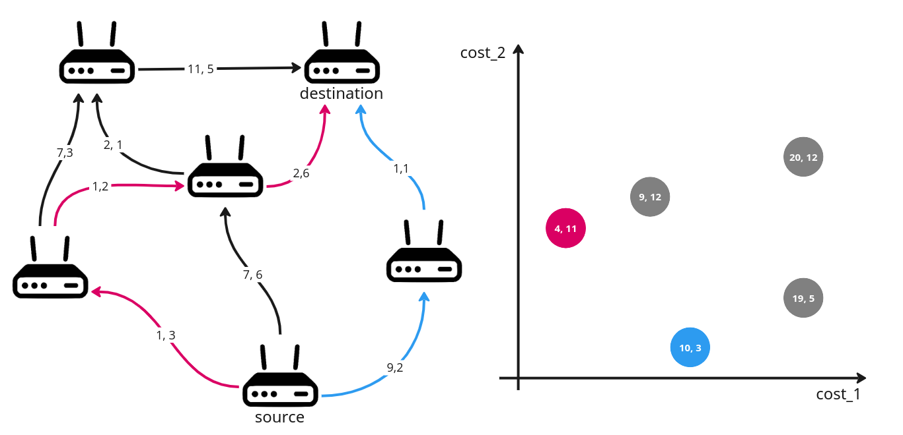

# Децентрализованная многокритериальная маршрутизация

Реализация и исследование децентрализованной многокритериальной маршрутизации в сетях.

## Описание задачи 

Компьютерные сети представляют собой множество устройств (узлов), объеденённых в единую  инфраструктуру. Основная цель сетей заключается в  эффективной передаче информации (пакетов) между узлами. Маршрут передачи данных зависит от алгоритмов, работающих на маршрутизаторах - устройствах, составляющих ядро сети. 

Каждый маршрутизатор имеет интерфейсы входящих и исходящих соединений. Основная задача, которую выполняет маршрутизатор — определение на какой из исходящий интерфейсов необходимо отправить пришедший пакет данных. Однако выбор оптимального маршрута - это сложная задача, особенно когда необходимо учитывать несколько критериев одновременно.

### Используемые обозначения:
в графе: vertex, edge
в алгоритме: edge
