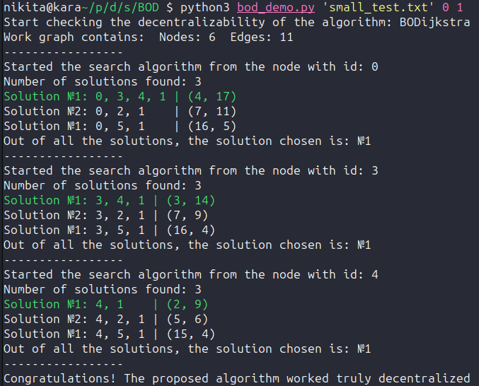

# Децентрализованная многокритериальная маршрутизация

<style>
.image-container {
    display: flex;
    flex-wrap: wrap;
    justify-content: space-around;
    align-items: center;
}

figure {
    margin: 0;
    text-align: center;
    padding-right: -40px;
}

figcaption {
    font-style: italic;
    font-size: 20px;
}

</style>


# diploma-mcs


### Формат тестового файла

```
ID_Начальная_вершина ID_Конечная_вершина Количество_найденных_путей
Суммарная_стоимость_по_признаку_1 Суммарная_стоимость_по_признаку_2 ID_Первая_веришина_в_пути ID_Вторая_вершина_в_пути ..."
.
.
.
Количество_вершин_в_тесте Количество_рёбер_в_тесте
ID_Вершина_1 ID_Вершина_2 Стоимость_1 Стоимость_2
.
.
.
```

Первая строка содержит три значения, разделенные пробелом: ID начальной вершины, ID конечной вершины и количество найденных путей между ними.

После этой строки следует информация о каждом найденном пути. Каждый путь начинается с двух значений, обозначающих суммарную стоимость пути по двум признакам.

Затем следует список вершин, входящих в этот путь. Каждая вершина обозначается своим ID.  

После всех найденных путей следует информация о количестве вершин и рёбер в тесте.  

Далее идет список рёбер графа, каждое ребро содержит две вершины, соединенные этим ребром, а также стоимость этого ребра по двум признакам.  

### Топологии тестов

<div class="image-container">
    <figure>
        
        <figcaption>"Мост"</figcaption>
    </figure>
    <figure>
        
        <figcaption>"Кольцо"</figcaption>
    </figure>
        <figure>
        
        <figcaption>"Случайность"</figcaption>
    </figure>
    <figure>
        
        <figcaption>"Коридор"</figcaption>
    </figure>
</div>

#### Топология "Мост"
Как и в теории графов, здесь мост - ребро, удаление которого увеличивает число компонент связности. Сам тест представляет из себя две компоненты связности, которые соединины мостом. Стартовая и конечная вершина расположены в разных компонентах связности. Сами компоненты связности составлены с использованием других топологий.

#### Топология "Кольцо"
Кльцо из N вершин, где каждая вершина соединена с соседними вершинами, образуя циклическую связь. Каждая вершина кольца также имеет связь с индивидуальной компонентой, отличной для каждой вершины кольца. Начальная и конечная вершины находятся в разных индивидуальных компонентах, принадлежащих разным вершинам кольца.

#### Топология "Коридор"
Однонаправленная цепочка вершин, где у каждой вершины есть связи с индивидуальными компонентами. Начальная вершина находится в первой вершине цепочки, конечная - в последней. 

#### Топология "Случайность"
Случайно соединённые вершины. Начальная и конечная точка не могут быть одной вершиной.




1. Нашёл ошибку в алгоритме проблема была в том, что я хранил слишком много данных для отладки. В экспортах файла указывался путь не в рабочий код, а тот, который использовался для отладки и в нём хранилось очень много дополнительных и ненужных данных.
2. Написал демо для BOD. Программа покащывает пошаговое выполнение алгоритма BOD и результаты его работы.
3. Дописал код для тестов
4. Оформил небольшой логотип своей работы.
5. 