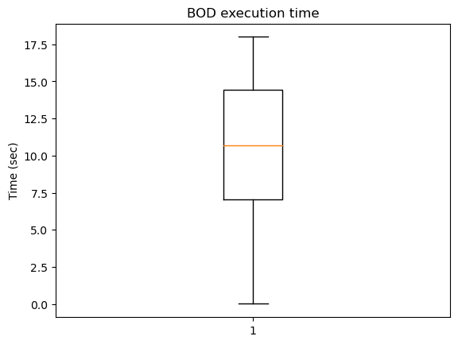

# Отчёт о проделанной работе

## Демо децентрализованности алгоритма
```
check_decentralization [-h] map_file_path start_node end_node [--verbose]
```

Перписал демонстратор работы BOD. Теперь у программы есть флаг -v --verbose, с которым будет выводится подробная информация о работе алгоритма. По умолчанию выводится только краткая информация:


```
$ python3 bod_demo.py small_test.txt, 0, 1

0 -> 3 -> 4 -> 1
0: 3, 2, 5
0 -> 3
3: 4, 2, 5
3 -> 4
4: 1, 2, 5
4 -> 1
Succes
```

И снова посмотрим на полную версию:

```
Start checking the decentralizability of the algorithm: BODijkstra
Work graph contains:  Nodes: 6  Edges: 11
-----------------
Started the search algorithm from the node with id: 0
Number of solutions found: 3
Solution №1: 0, 3, 4, 1 | (4, 17)
Solution №2: 0, 2, 1    | (7, 11)
Solution №1: 0, 5, 1    | (16, 5)
Out of all the solutions, the solution chosen is: №1
-----------------
Started the search algorithm from the node with id: 3
Number of solutions found: 3
Solution №1: 3, 4, 1 | (3, 14)
Solution №2: 3, 2, 1 | (7, 9)
Solution №1: 3, 5, 1 | (16, 4)
Out of all the solutions, the solution chosen is: №1
-----------------
Started the search algorithm from the node with id: 4
Number of solutions found: 3
Solution №1: 4, 1    | (2, 9)
Solution №2: 4, 2, 1 | (5, 6)
Solution №1: 4, 5, 1 | (15, 4)
Out of all the solutions, the solution chosen is: №1
-----------------
Congratulations! The proposed algorithm worked truly decentralized
```


## Бенчмаркинг BOD

Я успел написать только программу для бенчмаркинга и отрисовки графиков, сами тесты прогнать не успел.

### Метрики

* Время выполнения BOD (на каждой вершине)
* Частота встречаемости вершин в путях
* Разница между валидными путями и тем сколько путей было потеряно из-за ограничений на cost1 и cost2 





