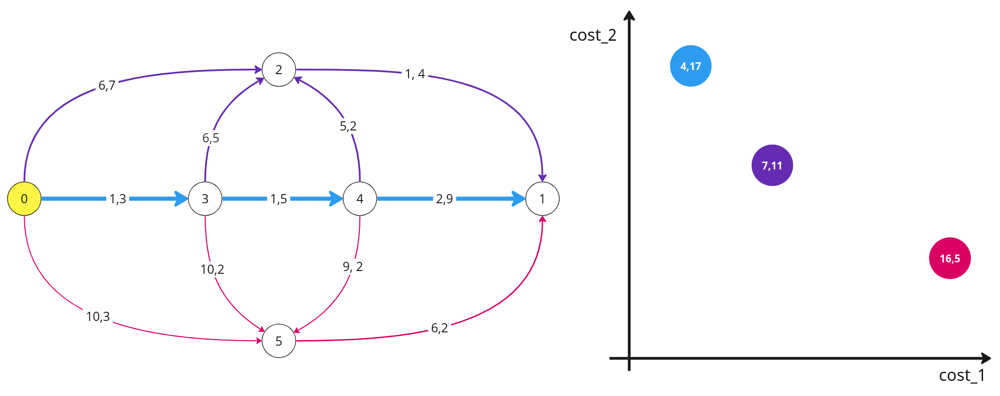
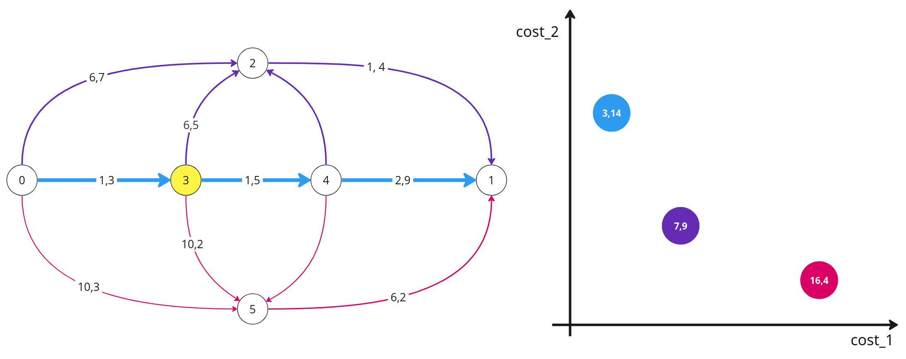
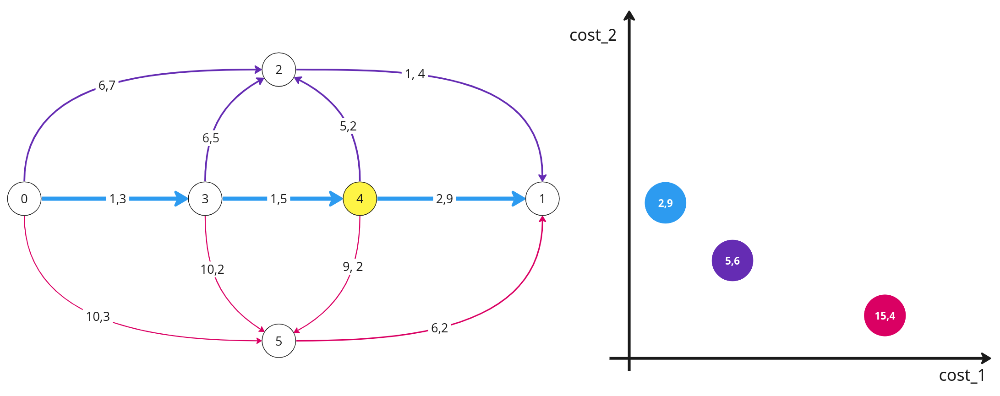

# Отчёт о проделанной работе
## Кратко о том, что я успел сделать:
1. Нашёл ошибку в коде, которая забивала память. Проблема была в том, что я хранил слишком много данных для отладки. В экспортах `.py` файлов указывался путь не на рабочий код, а на тот, который использовался для отладки и в нём классы содержали очень много лишних полей. Лучше никогда не называть файлы одинаково, даже если они лежат в разных дирректориях. 
2. Написал демо для BOD. Программа показывает пошаговое выполнение алгоритма BOD и результаты его работы. 
3. Дописал код для тестов, чтобы с ними было удобнее работать.
4. Оформил небольшой логотип своей работы (сверху)


## Демо BOD

Рассмотрим следующий пример BOD задачи и то, как для него отработает демо.  
Здесь начальная вершина - 0, а конечная - 1.





Теперь запустим программу `bod_demo.py`, которая имеет следующие параметры запуска:

```
>> python3 bod_demo.py [map_file_path] [start_node_id] [end_node_id]
```

```
Start checking the decentralizability of the algorithm: BODijkstra
Work graph contains:  Nodes: 6  Edges: 11
-----------------
Started the search algorithm from the node with id: 0
Number of solutions found: 3
Solution №1: 0, 3, 4, 1 | (4, 17)
Solution №2: 0, 2, 1    | (7, 11)
Solution №1: 0, 5, 1    | (16, 5)
Out of all the solutions, the solution chosen is: №1
-----------------
Started the search algorithm from the node with id: 3
Number of solutions found: 3
Solution №1: 3, 4, 1 | (3, 14)
Solution №2: 3, 2, 1 | (7, 9)
Solution №1: 3, 5, 1 | (16, 4)
Out of all the solutions, the solution chosen is: №1
-----------------
Started the search algorithm from the node with id: 4
Number of solutions found: 3
Solution №1: 4, 1    | (2, 9)
Solution №2: 4, 2, 1 | (5, 6)
Solution №1: 4, 5, 1 | (15, 4)
Out of all the solutions, the solution chosen is: №1
-----------------
Congratulations! The proposed algorithm worked truly decentralized
```
Ещё до запуска, внутри самого файла программы указывается алгоритм поиска и алгоритм выбора маршрута, которые будут тестироваться. Для примера мы будем использовать алгоритм выбора, который всегда будет выбирать наименьшее по cost_1 решение.

Программа запускает BOD последовательно, каждый раз выбирая в качестве начальной вершины следующую вершину выбранного на предыдущем этапе маршрута (изначально запускается на start_node). После того, как BOD отработала, программа выводит все найденные пути и их суммарные веса. Затем алгоритм выбора маршрута определяет какой из них будет выбран и программа сообщает об этом. В конце, если всё прошло успешно, программа выведет, что тестируемый алгоритм отработал децентрализованно. Если это не так, то программа завершится на том этапе, где была нарушена децентрализованность. 


Теперь запустим программу на рандомном тесте:

```
Start checking the decentralizability of the algorithm: BODijkstra
Work graph contains:  Nodes: 1024  Edges: 30514
-----------------
Started the search algorithm from the node with id: 0
Number of solutions found: 4
Solution №1: 0, 19, 1009, 680, 1        | (19, 49)
Solution №2: 0, 30, 8, 814, 1           | (24, 39)
Solution №3: 0, 548, 213, 92, 365 1     | (63, 20)
Solution №4: 0, 724, 136, 891, 602, 619 | (68, 12)
Out of all the solutions, the solution chosen is: №1
-----------------
Started the search algorithm from the node with id: 19
Number of solutions found: 2
Solution №1: 19, 1009, 680, 1 | (18, 39)
Solution №2: 19, 84, 202      | (31, 37)
Out of all the solutions, the solution chosen is: №1
-----------------
Started the search algorithm from the node with id: 1009
Number of solutions found: 3
Solution №1: 1009, 680, 1        | (14, 22)
Solution №2: 1009, 721, 275, 843 | (17, 19)
Out of all the solutions, the solution chosen is: №1
-----------------
Started the search algorithm from the node with id: 680
Number of solutions found: 1
Solution №1: 680, 1 | (2, 11)
Out of all the solutions, the solution chosen is: №1
-----------------
Congratulations! The proposed algorithm worked truly decentralized

```